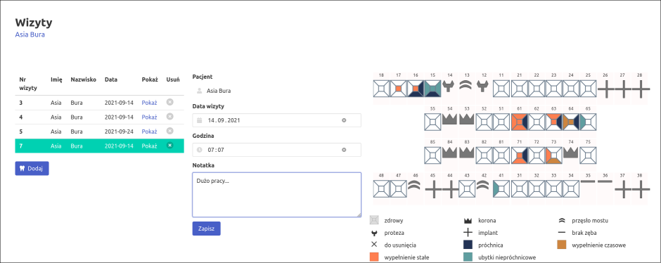

# Gabinet Spokojny Ząb

This is a tiny webapp (local, no cloud) for dentists that stores data in SQLite.

Written as an excercise during learning Go and Javascript.

# Warnings

**Warning**
Web inerface is only available in Polish language.

**Warning2**
Don't use in production.

# Running

To run this program, execute:
`go run main.go aa.db`
where `aa.db` is your datbase (SQLite) file.

# Todo
 - pagination in tables
 - clickable whole row
 - expose color, shape and states for change/definition 

# Technologies
* server code: Go
* frontent: Javascript
* css: Bulma
* shapes: designed in https://yqnn.github.io/svg-path-editor/
* blog: https://kamilachyla.com/tags/gabinet/
