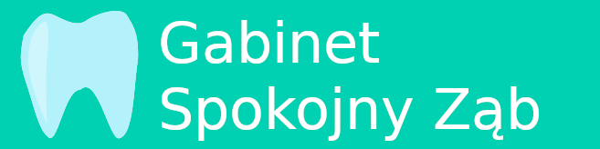
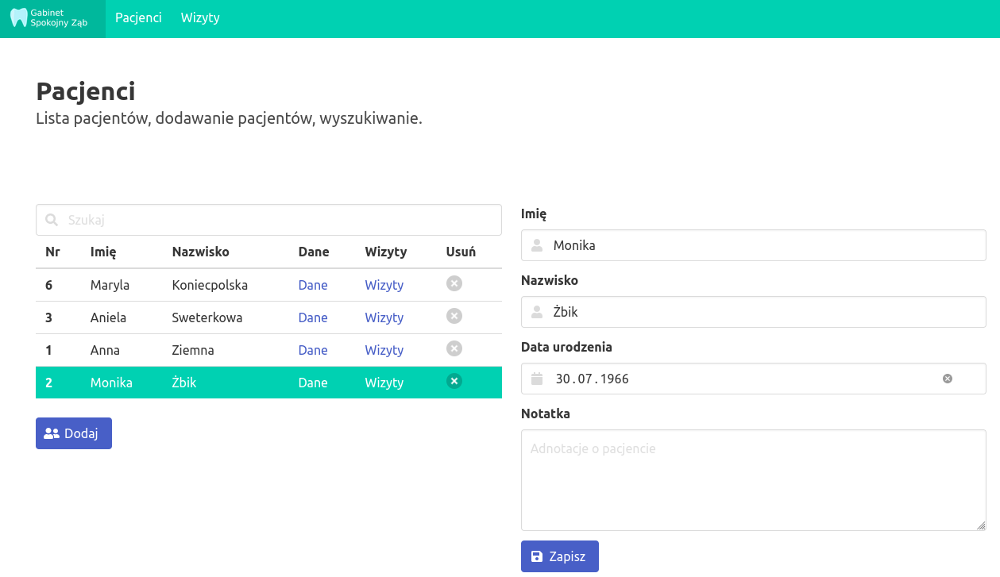

Tiny webapp (local, no cloud) for dentists that stores data in SQLite.
Written as excercise when learning Go.

## Running

To run this program, execute:

`go run main.go patient_routes.go visit_routes.go routes.go aa.db`

where `aa.db` is your datbase (SQLite) file.

## Todo

### Patients
Route `/patients`:
- the table should have pagination for browsing; state should remeber current page 

### Visits
 - pagination

### Dental notation block for patient and single visit
 - view of [teeth](https://en.wikipedia.org/wiki/Human_tooth) like dentists need and use:
    * [PL: system oznaczania zębów](https://pl.wikipedia.org/wiki/Systemy_oznaczania_z%C4%99b%C3%B3w])
    * [EN: dental notation ](https://en.wikipedia.org/wiki/Dental_notation)

### Table
Selection - maybe clickable whole row?

## Warnings

**Warning**

Web inerface is only available in Polish language.

**Warning2**

Don't use in production.

